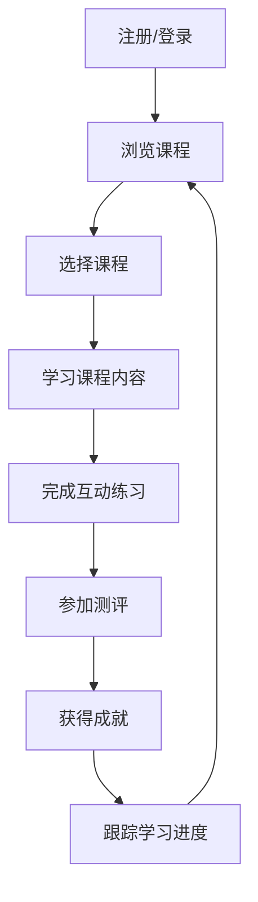

## 1. Product Overview
基于Python的数据分析在线教育平台，为商务数据分析与应用专业学生提供完整的学习体系和互动式学习体验。
- 解决商务数据分析专业学生缺乏系统化、互动式学习平台的问题，帮助学生掌握数据分析技能。
- 目标市场为高等教育机构的商务数据分析专业学生，提供专业、实用的在线学习资源。

## 2. Core Features

### 2.1 User Roles
| Role | Registration Method | Core Permissions |
|------|---------------------|------------------|
| Student | Email registration | Access courses, practice, assessments, view achievements |
| Instructor | Admin invitation | Manage courses, create assessments, view student progress |

### 2.2 Feature Module
1. **Home page**: Hero section, course categories, featured courses, user dashboard
2. **Course page**: Course content, interactive exercises, assessments
3. **Achievement page**: Progress tracking, badges, certificates

### 2.3 Page Details
| Page Name | Module Name | Feature description |
|-----------|-------------|---------------------|
| Home page | Hero section | Platform introduction, key features, call-to-action |
| Home page | Course categories | Organized course topics (Python basics, data visualization, business analytics) |
| Home page | User dashboard | Personalized learning progress, recommended courses |
| Course page | Course content | Video lectures, interactive Python code editors, reading materials |
| Course page | Interactive exercises | Hands-on coding challenges, real-time feedback |
| Course page | Assessments | Quizzes, projects, grading system |
| Achievement page | Progress tracking | Visual representation of learning journey, completion rates |
| Achievement page | Badges | Earnable achievements for course completion, skill mastery |
| Achievement page | Certificates | Digital certificates for completed courses |

## 3. Core Process
### User Learning Flow
1. User registers and logs in to the platform
2. User browses course categories and selects a course
3. User accesses course content (videos, readings, code examples)
4. User completes interactive exercises and receives feedback
5. User takes assessments to test knowledge
6. User earns badges and certificates upon completion
7. User tracks progress on the achievement page

## 4. User Interface Design
### 4.1 Design Style
- Primary color: #3b82f6 (blue)
- Secondary color: #10b981 (green)
- Accent color: #f59e0b (amber)
- Button style: Rounded corners, subtle shadows
- Font: Inter (sans-serif)
- Font sizes: Headings (24-36px), body text (16px), small text (14px)
- Layout style: Card-based design, top navigation, clean whitespace
- Icon style: Modern, minimal line icons

### 4.2 Page Design Overview
| Page Name | Module Name | UI Elements |
|-----------|-------------|-------------|
| Home page | Hero section | Large hero image with platform name, short description, and "Get Started" button. Background with subtle data visualization elements. |
| Home page | Course categories | Grid of category cards with icons, category names, and course counts. Hover effects with shadow and scale. |
| Home page | User dashboard | Sidebar with navigation, main content area with progress charts, recent activities, and recommended courses. |
| Course page | Course content | Video player, code editor with syntax highlighting, collapsible sections for readings. Progress indicator at top. |
| Course page | Interactive exercises | Code editor with run button, test cases display, feedback messages. Submission history. |
| Course page | Assessments | Quiz interface with multiple choice, coding questions, and time limits. Instant scoring. |
| Achievement page | Progress tracking | Timeline view of completed courses, circular progress indicators for skill levels. |
| Achievement page | Badges | Grid of earned and unearned badges with tooltips explaining requirements. |
| Achievement page | Certificates | Gallery of digital certificates with download option. |

### 4.3 Responsiveness
- Desktop-first design with responsive breakpoints
- Mobile-adaptive layout with stacked elements on smaller screens
- Touch optimization for interactive elements on mobile devices
- Collapsible navigation menu for mobile

### 4.4 3D Scene Guidance
Not applicable for this project.