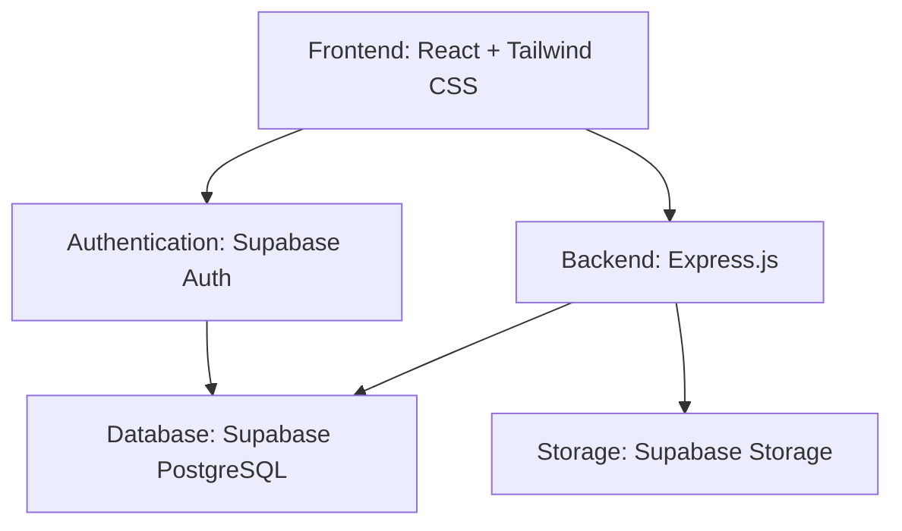
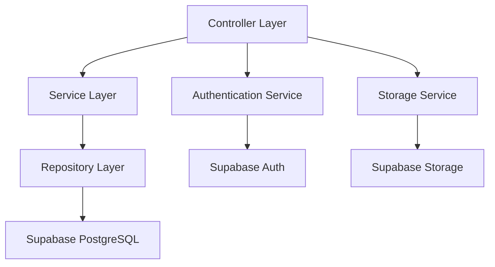
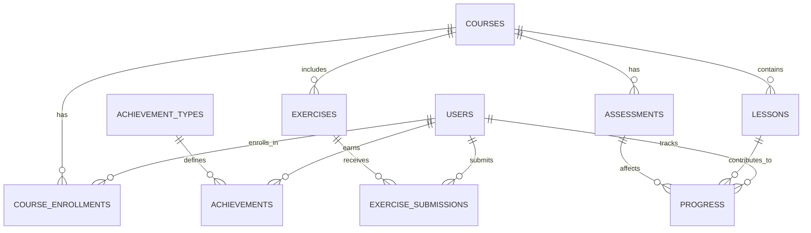

## 1. Architecture Design


## 2. Technology Description
- Frontend: React@18 + tailwindcss@3 + vite
- Initialization Tool: vite-init
- Backend: Express@4 (for server-side logic)
- Database: Supabase (PostgreSQL) for user data, course content, and achievements
- Authentication: Supabase Auth
- Storage: Supabase Storage (for course materials, videos, certificates)
- Deployment: Cloudflare Pages

## 3. Route Definitions
| Route | Purpose |
|-------|---------|
| / | Home page with hero section and course categories |
| /dashboard | User dashboard with personalized progress |
| /courses | Course listing page |
| /courses/:id | Course detail page with content and exercises |
| /achievements | Achievement page with badges and certificates |
| /login | User login page |
| /register | User registration page |
| /instructor | Instructor dashboard (admin only) |

## 4. API Definitions
### 4.1 User Authentication
- POST /api/auth/register: Register new user
- POST /api/auth/login: User login
- POST /api/auth/logout: User logout
- GET /api/auth/me: Get current user information

### 4.2 Course Management
- GET /api/courses: Get all courses
- GET /api/courses/:id: Get course details
- POST /api/courses (instructor only): Create new course
- PUT /api/courses/:id (instructor only): Update course
- DELETE /api/courses/:id (instructor only): Delete course

### 4.3 Progress Tracking
- GET /api/progress: Get user progress
- POST /api/progress: Update user progress
- GET /api/achievements: Get user achievements

### 4.4 Exercise Submission
- POST /api/exercises/:id/submit: Submit exercise solution
- GET /api/exercises/:id/feedback: Get exercise feedback

## 5. Server Architecture Diagram


## 6. Data Model
### 6.1 Data Model Definition


### 6.2 Data Definition Language
```sql
-- Users table
CREATE TABLE users (
  id UUID PRIMARY KEY,
  email TEXT UNIQUE NOT NULL,
  name TEXT NOT NULL,
  role TEXT DEFAULT 'student',
  created_at TIMESTAMP DEFAULT NOW()
);

-- Courses table
CREATE TABLE courses (
  id UUID PRIMARY KEY,
  title TEXT NOT NULL,
  description TEXT,
  category TEXT,
  difficulty TEXT,
  instructor_id UUID REFERENCES users(id),
  created_at TIMESTAMP DEFAULT NOW()
);

-- Course enrollments table
CREATE TABLE course_enrollments (
  id UUID PRIMARY KEY,
  user_id UUID REFERENCES users(id),
  course_id UUID REFERENCES courses(id),
  enrolled_at TIMESTAMP DEFAULT NOW(),
  completed_at TIMESTAMP
);

-- Lessons table
CREATE TABLE lessons (
  id UUID PRIMARY KEY,
  course_id UUID REFERENCES courses(id),
  title TEXT NOT NULL,
  content TEXT,
  order_number INTEGER,
  video_url TEXT,
  reading_material TEXT
);

-- Exercises table
CREATE TABLE exercises (
  id UUID PRIMARY KEY,
  lesson_id UUID REFERENCES lessons(id),
  title TEXT NOT NULL,
  description TEXT,
  difficulty TEXT,
  test_cases JSONB,
  solution TEXT
);

-- Exercise submissions table
CREATE TABLE exercise_submissions (
  id UUID PRIMARY KEY,
  user_id UUID REFERENCES users(id),
  exercise_id UUID REFERENCES exercises(id),
  code TEXT NOT NULL,
  submitted_at TIMESTAMP DEFAULT NOW(),
  passed BOOLEAN,
  feedback TEXT
);

-- Assessments table
CREATE TABLE assessments (
  id UUID PRIMARY KEY,
  course_id UUID REFERENCES courses(id),
  title TEXT NOT NULL,
  description TEXT,
  questions JSONB,
  passing_score INTEGER
);

-- Progress table
CREATE TABLE progress (
  id UUID PRIMARY KEY,
  user_id UUID REFERENCES users(id),
  lesson_id UUID REFERENCES lessons(id),
  completed BOOLEAN DEFAULT FALSE,
  completed_at TIMESTAMP
);

-- Achievement types table
CREATE TABLE achievement_types (
  id UUID PRIMARY KEY,
  name TEXT NOT NULL,
  description TEXT,
  icon TEXT,
  requirement JSONB
);

-- Achievements table
CREATE TABLE achievements (
  id UUID PRIMARY KEY,
  user_id UUID REFERENCES users(id),
  achievement_type_id UUID REFERENCES achievement_types(id),
  earned_at TIMESTAMP DEFAULT NOW()
);

-- Permissions
GRANT SELECT ON ALL TABLES TO anon;
GRANT ALL PRIVILEGES ON ALL TABLES TO authenticated;

-- Enable Row Level Security
ALTER TABLE users ENABLE ROW LEVEL SECURITY;
ALTER TABLE courses ENABLE ROW LEVEL SECURITY;
ALTER TABLE course_enrollments ENABLE ROW LEVEL SECURITY;
ALTER TABLE lessons ENABLE ROW LEVEL SECURITY;
ALTER TABLE exercises ENABLE ROW LEVEL SECURITY;
ALTER TABLE exercise_submissions ENABLE ROW LEVEL SECURITY;
ALTER TABLE assessments ENABLE ROW LEVEL SECURITY;
ALTER TABLE progress ENABLE ROW LEVEL SECURITY;
ALTER TABLE achievement_types ENABLE ROW LEVEL SECURITY;
ALTER TABLE achievements ENABLE ROW LEVEL SECURITY;

-- RLS Policies
CREATE POLICY "Users can view own data" ON users FOR SELECT USING (auth.uid() = id);
CREATE POLICY "Users can update own data" ON users FOR UPDATE USING (auth.uid() = id);

CREATE POLICY "Public can view courses" ON courses FOR SELECT USING (true);
CREATE POLICY "Instructors can create courses" ON courses FOR INSERT WITH CHECK (auth.jwt() ->> 'role' = 'instructor');

CREATE POLICY "Users can view own enrollments" ON course_enrollments FOR SELECT USING (auth.uid() = user_id);
CREATE POLICY "Users can enroll in courses" ON course_enrollments FOR INSERT WITH CHECK (auth.uid() = user_id);

CREATE POLICY "Public can view lessons" ON lessons FOR SELECT USING (true);

CREATE POLICY "Public can view exercises" ON exercises FOR SELECT USING (true);
CREATE POLICY "Users can submit exercises" ON exercise_submissions FOR INSERT WITH CHECK (auth.uid() = user_id);
CREATE POLICY "Users can view own submissions" ON exercise_submissions FOR SELECT USING (auth.uid() = user_id);

CREATE POLICY "Public can view assessments" ON assessments FOR SELECT USING (true);

CREATE POLICY "Users can view own progress" ON progress FOR SELECT USING (auth.uid() = user_id);
CREATE POLICY "Users can update own progress" ON progress FOR INSERT WITH CHECK (auth.uid() = user_id);
CREATE POLICY "Users can update own progress" ON progress FOR UPDATE USING (auth.uid() = user_id);

CREATE POLICY "Public can view achievement types" ON achievement_types FOR SELECT USING (true);
CREATE POLICY "Users can view own achievements" ON achievements FOR SELECT USING (auth.uid() = user_id);
```